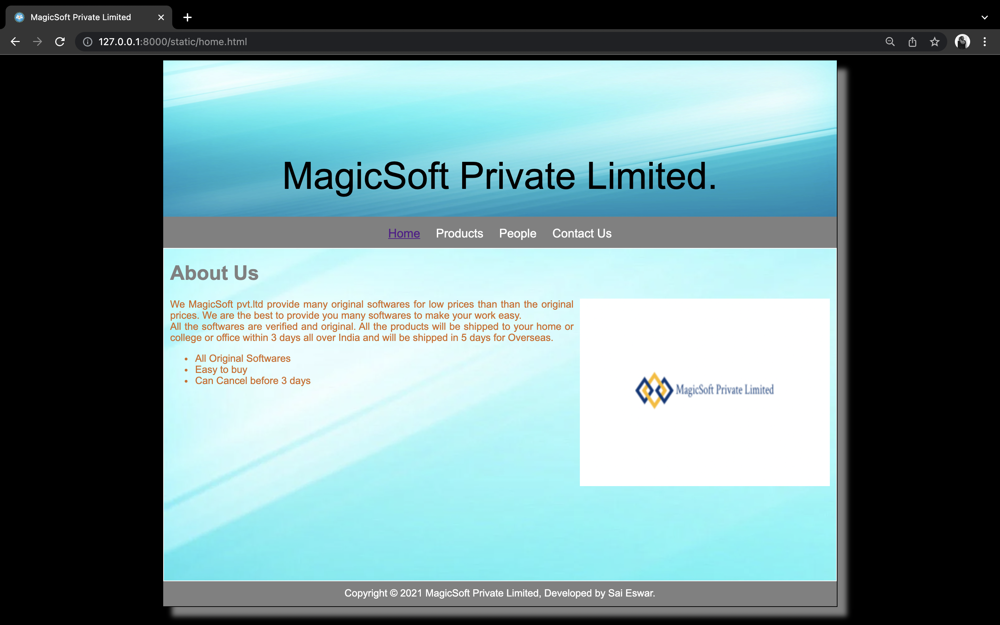
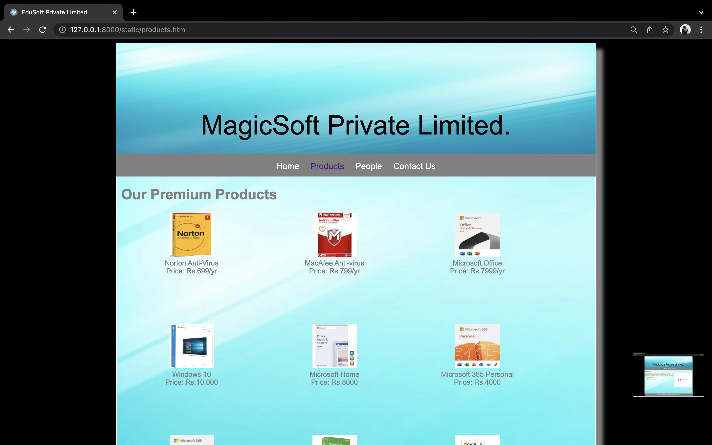
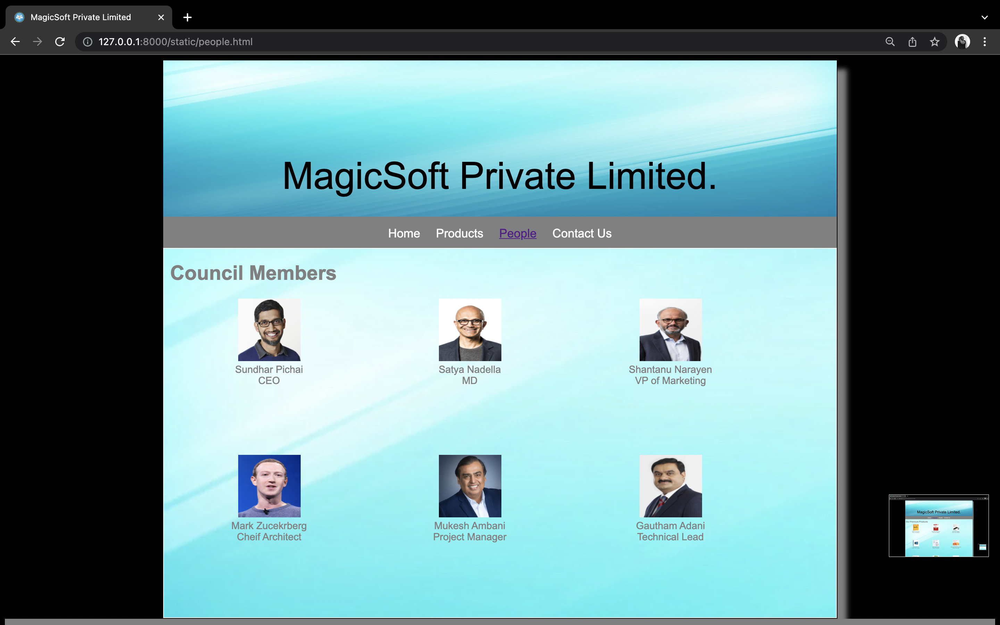
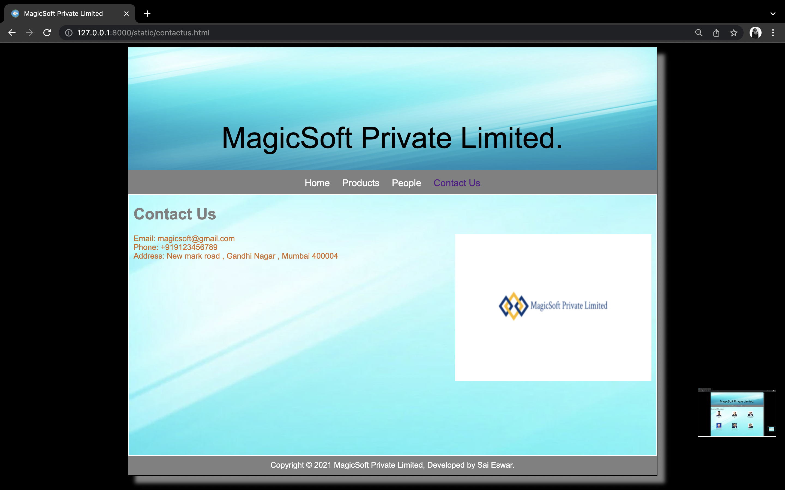

# Web Design for a Software Product Company

## AIM:

To design a static website for a software product company company.

## DESIGN STEPS:

### Step 1:

Requirement collection.

### Step 2:

Creating the layout using HTML and CSS.

### Step 3:

Updating the sample content.

### Step 4:

Choose the appropriate style and color scheme.

### Step 5:

Validate the layout in various browsers.

### Step 6:

Validate the HTML code.

### Step 6:

Publish the website in the given URL.

## PROGRAM :

### layout.css:
~~~
* {
  box-sizing: border-box;
  font-family: Arial, Helvetica, sans-serif;
}
body {
  background-color: black;
  color: black;
}
.container {
  width: 1080px;
  margin-left: auto;
  margin-right: auto;
  border-width: 1px 1px 1px 1px;
  border-style: solid;
  box-shadow: 15px 15px 8px gray;
}

.banner {
  display: block;
  width: 100%;
  height: 250px;
  text-align: center;
  font-size: 60px;
  background-image: url("https://wallpaperaccess.com/full/1567838.jpg");
  background-size: 100% 100%;
  margin: 0px 0px 0px 0px;
  padding-top: 150px;
  color: black;
}

.menu {
  display: block;
  width: 100%;
  height: 50px;
  font-size: larger;
  background-color: grey;
  text-align: center;
  padding-top: 15px;
  margin: 0px 0px 0px 0px;
  border-width: 1px;
}

.menuitem {
  display: inline-block;
  margin-left: 10px;
  margin-right: 10px;
}
.menuitemselected {
  display: inline-block;
  margin-left: 10px;
  margin-right: 10px;
  color: #004445;
}

.menuitem a {
  text-decoration: none;
  color: white;
}

.content {
  display: block;
  width: 100%;
  background-image:url("https://wallpaperaccess.com/full/1567838.jpg");
  min-height: 500px;
  margin: 0px 0px 0px 0px;
  border-width: 1px;
  border-color: white;
  border-style: solid;
  color: grey;
}
.homecontent {
  min-height: 500px;
  margin: 10px 10px 10px 10px;
  color: grey;
}
.homecontent h1 {
  text-align: left;
}
.homecontent img {
  float: right;
  width: 400px;
  height: 300px;
  margin-left: 10px;
}

.contenttext {
  text-align: justify;
  color: chocolate;
}

.productcontent {
  min-height: 500px;
  margin: 10px 10px 10px 10px;
}

.productcontent h1 {
  text-align: left;
}

.productitems {
  display: block;
}

.productitem {
  display: inline-block;
  width: 30%;
  height: 250px;
  text-align: center;
}

.productitem img {
  width: 100px;
  height: 100px;
  display: block;
}
.productitem .itemimage {
  display: block;
  margin-left: auto;
  margin-right: auto;
  width: 100px;
  margin-bottom: 5px;
}

.productitem .itemname {
  display: block;
}
.productitem .itemprice {
  display: block;
}

.footer {
  display: block;
  width: 100%;
  height: 40px;
  background-color: grey;
  text-align: center;
  padding-top: 10px;
  margin: 0px 0px 0px 0px;
  color: white;
}
~~~

### home.html:
~~~
<!DOCTYPE html>
<html lang="en">
  <head>
    <title>MagicSoft Private Limited</title>
    <link rel="stylesheet" href="./css/layout.css" />
    <link rel="icon" href="./img/icon.png" type="image/x-icon" />
  </head>

  <body>
    

      
MagicSoft Private Limited.

      

        
<a href="/static/home.html">Home</a>

        
<a href="/static/products.html">Products</a>

        
<a href="/static/people.html">People</a>

        
<a href="/static/contactus.html">Contact Us</a>

      

      

        

          <h1>About Us</h1>
          
          

            We MagicSoft pvt.ltd provide many original softwares for low prices than than the original prices.
            We are the best to provide you many softwares to make your work easy. 
             
            All the softwares are verified and original. All the products will be shipped to your home or 
            college or office within 3 days all over India and will be shipped in 5 days for Overseas.
            <ul>
              <li>All Original Softwares</li>
              <li>Easy to buy</li>
              <li>Can Cancel before 3 days</li>
            </ul>
          

        

      

      

        Copyright &#169; 2021 MagicSoft Private Limited, Developed by Sai Eswar.
      

    

  </body>
</html>
~~~

### products.html:
~~~
<!DOCTYPE html>
<html lang="en">
  <head>
    <title>EduSoft Private Limited</title>
    <link rel="stylesheet" href="./css/layout.css" />
    <link rel="icon" href="./img/icon.png" type="image/x-icon" />
  </head>

  <body>
    

      
MagicSoft Private Limited.

      

        
<a href="/static/home.html">Home</a>

        
 <a href="/static/products.html">Products</a> 

        
<a href="/static/people.html">People</a>

        
<a href="/static/contactus.html">Contact Us</a>

      

      

        
    
          <h1>Our Premium Products</h1>
          

              
 
                  

                  
                  

                  
Norton Anti-Virus

                  
Price: Rs.699/yr 

              

              
 
                  

                  
                  

                  
MacAfee Anti-virus

                  
Price: Rs.799/yr 

              

              
 
                  

                  
                  

                  
Microsoft Office

                  
Price: Rs.7999/yr 

              

              
 
                

                
                

                
Windows 10

                
Price: Rs.10,000 

            

            
 
              

              
              

              
Microsoft Home

              
Price: Rs.8000 

            

            
 
            

            
            

            
Microsoft 365 Personal

            
Price: Rs.4000 

          

          
 
          

          
          

          
Microsoft 365 Family

          
Price: Rs.6000

        

        
 
          

          
          

          
QuickHeal Anti-Virus

          
Price: Rs.1000/yr 

        

        
 
          

          
          

          
Avast Anti-Virus

          
Price: Rs.799/yr 

        

        
 
          

          
          

          
Adobe Photoshop

          
Price: Rs.3999/yr 

      

      
 
        

        
        

        
Ubuntu

        
Price: Rs.9000 

      

      
 
      

      
      

      
PureOS

      
Price: Rs.16,000 

      

      

          
        
        

      

        Copyright &#169; 2021 MagicSoft Private Limited, Developed by Sai Eswar.
      

    

  </body>
</html>
~~~

### people.html:
~~~
<!DOCTYPE html>
<html lang="en">
  <head>
    <title>MagicSoft Private Limited</title>
    <link rel="stylesheet" href="./css/layout.css" />
    <link rel="icon" href="./img/icon.png" type="image/x-icon" />
  </head>

  <body>
    

      
MagicSoft Private Limited.

      

        
<a href="/static/home.html">Home</a>

        

          <a href="/static/products.html">Products</a>
        

        
<a href="/static/people.html">People</a>

        
<a href="/static/contactus.html">Contact Us</a>

      

      

        
    
          <h1>Council Members</h1>
          
 
          

          
          

          
Sundhar Pichai

          
CEO

        

        
 
          

          
          

          
Satya Nadella

          
MD

        

        
 
          

          
          

          
Shantanu Narayen

          
VP of Marketing

        

        
 
          

          
          

          
Mark Zucekrberg

          
Cheif Architect

      

      
 
        

        
        

        
Mukesh Ambani

        
Project Manager

      

      
 
      

      
      

      
Gautham Adani

      
Technical Lead

      

      

          
        
        

      

        Copyright &#169; 2021 MagicSoft Private Limited, Developed by Sai Eswar.
      

    

  </body>
</html>
~~~

### contactus.html:
~~~
<!DOCTYPE html>
<html lang="en">
  <head>
    <title>MagicSoft Private Limited</title>
    <link rel="stylesheet" href="./css/layout.css" />
    <link rel="icon" href="./img/icon.png" type="image/x-icon" />
  </head>

  <body>
    

      
MagicSoft Private Limited.

      

        
<a href="/static/home.html">Home</a>

        
<a href="/static/products.html">Products</a>

        
<a href="/static/people.html">People</a>

        
<a href="/static/contactus.html">Contact Us</a>

      

      

        

          <h1>Contact Us</h1>
          
          

            Email: magicsoft@gmail.com
             
            Phone: +919123456789
             
            Address: New mark road , Gandhi Nagar , Mumbai 400004

          

        

      

      

        Copyright &#169; 2021 MagicSoft Private Limited, Developed by Sai Eswar.
      

    

  </body>
</html>
~~~

## OUTPUT:

### Home Page:

### Product Page:

### People Page:

### Contact Us Page:

## Result:

Thus a website is designed for the software product company and the HTML,CSS code are validated.
